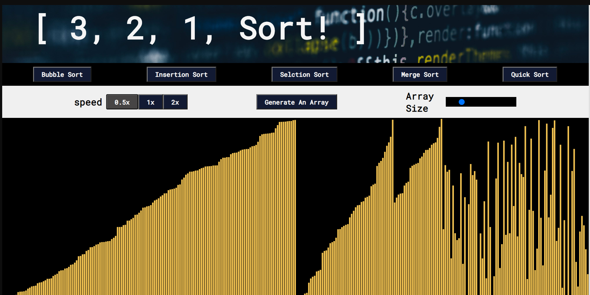

# -3-2-1-sort-
## A sorting visualization web app

### I created this project after finishing an amazing Udemy course on data structure & algorithms.
### I was thinking to myself, how can I show some of the things I have learned in the course?... This is the result.
### What can you do?
generate an array,
Pick the size of the array and the speed you want the sorting algorithm to move in!
Don't forget to pick the sorting algorithm itself :)

### For this project I used:
- HTML 
- CSS
- JavaScript 
- p5 JavaScript library for the animations

